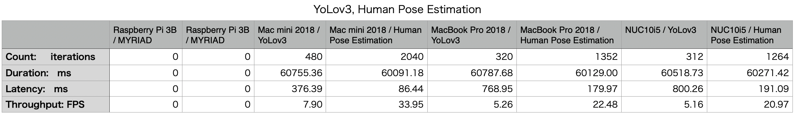
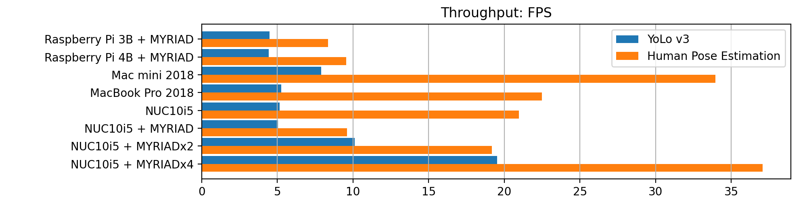
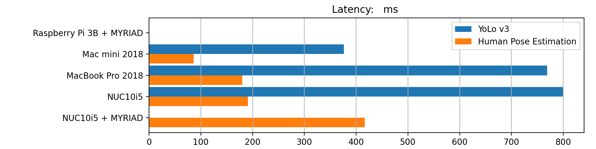

# benchmark OpenVINO

- Raspberry Pi 3B : ARM Cortex-A53, 4コア, 1.2GHz
- Raspberry Pi 4B : ARM Cortex-A72, 4コア, 1.5GHz
- Mac mini 2018 : Core i5-8500B, 6コア, 3.00GHz
- MacBook Pro 2018 : Core i5-8259, 8コア, 2.30GHz
- NUC10i5 : Core i5-10210U, 8コア, 1.60GHz

※ 複数の MYRIAD の latency は計測されない。

## Reference

- [human-pose-estimation-0001](https://docs.openvinotoolkit.org/2019_R1/_human_pose_estimation_0001_description_human_pose_estimation_0001.html)
- [Human Pose Estimation C++ Demo](https://docs.openvinotoolkit.org/latest/omz_demos_human_pose_estimation_demo_README.html)
- [YOLOv3 を OpenVINO™ ツールキットで使用する IR 形式へ変換してみよう](https://macnicago.zendesk.com/hc/ja/articles/360042709871-YOLOv3-%E3%82%92-OpenVINO-%E3%83%84%E3%83%BC%E3%83%AB%E3%82%AD%E3%83%83%E3%83%88%E3%81%A7%E4%BD%BF%E7%94%A8%E3%81%99%E3%82%8B-IR-%E5%BD%A2%E5%BC%8F%E3%81%B8%E5%A4%89%E6%8F%9B%E3%81%97%E3%81%A6%E3%81%BF%E3%82%88%E3%81%86)
- [Object Detection YOLO* V3 C++ Demo, Async API Performance Showcase](https://docs.openvinotoolkit.org/latest/omz_demos_object_detection_demo_yolov3_async_README.html)

## tools

- [Bencjmark C++ Tool](https://docs.openvinotoolkit.org/latest/openvino_inference_engine_samples_benchmark_app_README.html)
