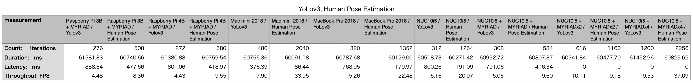
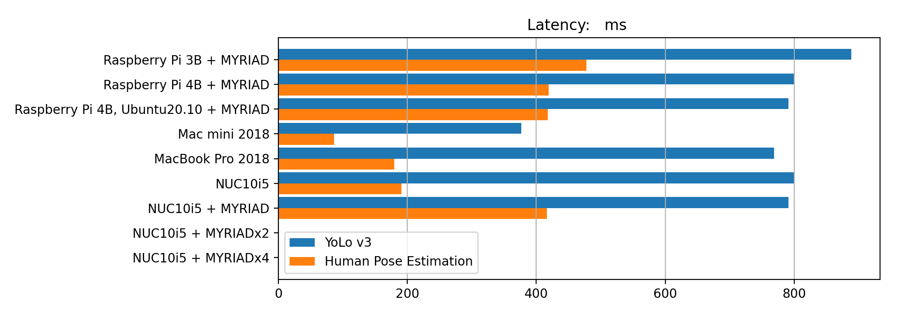
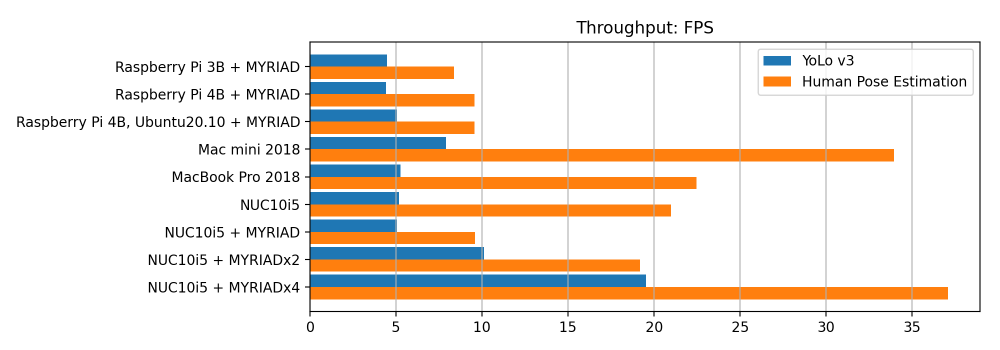

# benchmark OpenVINO

- Raspberry Pi 3B : ARM Cortex-A53, 4コア, 1.2GHz
- Mac mini 2018 : Core i5-8500B, 6コア, 3.00GHz
- MacBook Pro 2018 : Core i5-8259, 8コア, 2.30GHz
- NUC10i5 : Core i5-10210U, 8コア, 1.60GHz

## tools

- [Bencjmark C++ Tool](https://docs.openvinotoolkit.org/latest/openvino_inference_engine_samples_benchmark_app_README.html)
